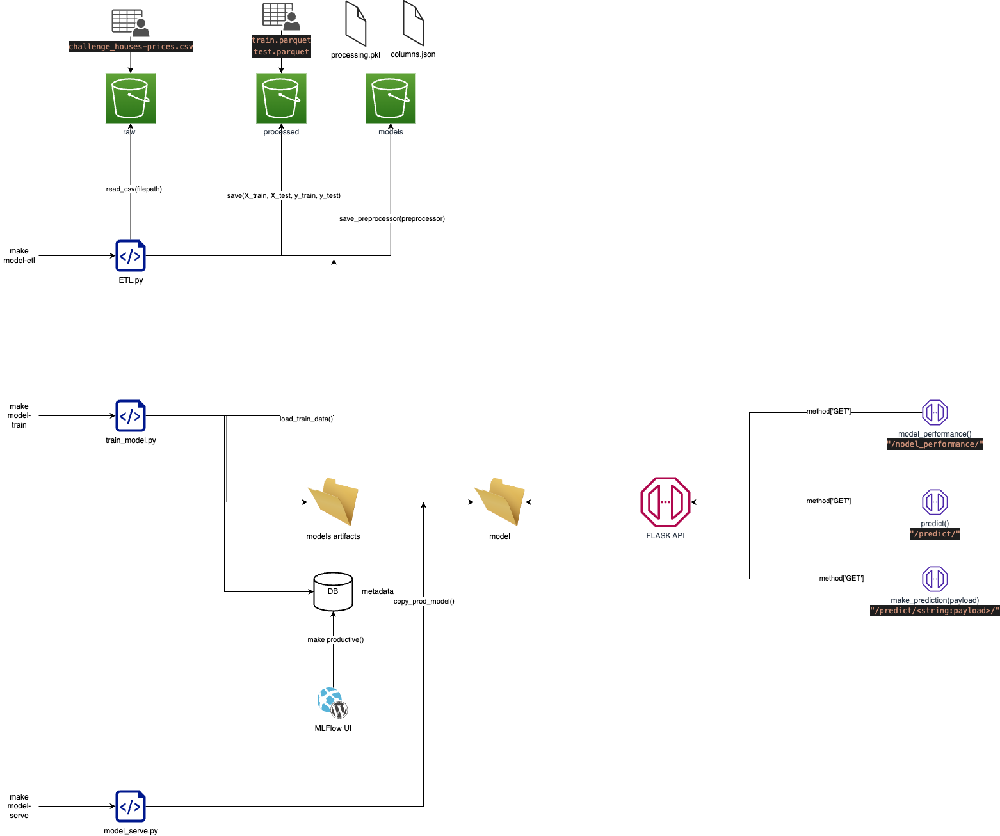

# House price prediction with Machine Learning

## Getting started

This repository contains the code for the example as required.

## Prerequisites

- Python 3.9
- Make


## 1 - Data Exploration and Modeling into Jupyter Notebook

The first step is to explore the data and build a model. The notebook is available in the `notebooks` folder.

- open the notebook `notebooks/01-model.ipynb`

the notebook contains the following steps:

1 - Data exploration

2 - Data preparation

3 - Model selection

4 - Model evaluation

5 - Model tuning

6 - Model prediction


## 2 - Build a Model with MLflow

The second step is to build a model with MLflow. The code is available in the `src/mlflow` folder.

### 2.1 - Run the code  

To run the code, you need to install the dependencies. You can do it with the following command:

```make install```

### 2.2 - Run the model training

Then, you can run the model training with the following command:

```make model-train```

### 2.3 - Run the MLflow UI (to make model production ready)

To run the MLflow UI, you need to install the dependencies. You can do it with the following command:

```make install```

Then, you can run the MLflow UI with the following command:

```make mlflow-ui```

In the MLflow UI, you can see the model and the parameters used to train it.

- go to http://localhost:5000
- click on the 'Model' tab
- select the version of the model
- select the 'Stage' and click on 'Transition to Production'

### 2.4 - Run the model prediction

Then, you can run the model prediction with the following command:

```make model-predict```

### 2.5 - Run the API 

To run the Falsk API, you need to install the dependencies. You can do it with the following command:

```make install```

Then, you can run the Flask API with the following command:

```make run``` or ```make run-dev```

In the Flask API, you can see the model and the model performance.

- go to http://localhost:5000/model_performance
- go to http://localhost:5000/predict
- go to http://localhost:5000/predict/{string:features}

### 3 - ML lifecycle architecture

The ML lifecycle architecture is available in the `src/img` folder.

- [ML lifecycle architecture](src/img/ml_lifecycle_architecture.png)





